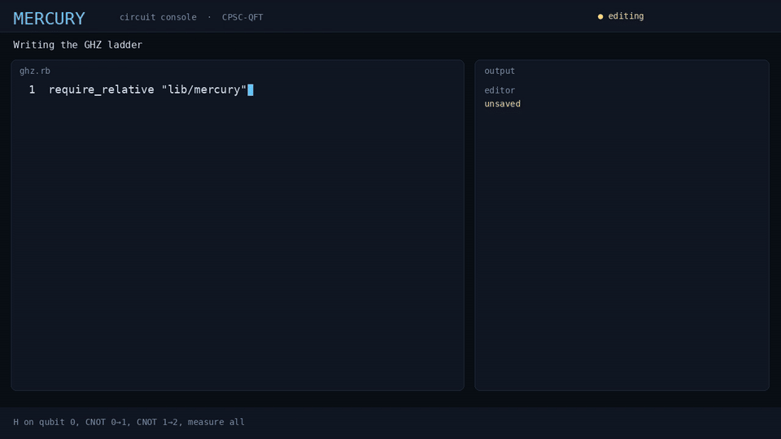

<!--
Copyright (c) 2026 Ahmad Ali Parr and others.
SPDX-License-Identifier: LicenseRef-CPSC-ESCL-1.0 OR AGPL-3.0-only
This file is dual-licensed under the CPSC Eclipse Strict Copyleft License v1.0
or the GNU AGPL v3 only. Both are strict copyleft.
-->

# CPSC — Conservation-Preserving Scattering Compiler

Proof-carrying lattice scattering for 1+1D scalar field theory. Conservation laws are compilation constraints, not post-selection filters.

**Status:** prototype. The analyzer, translation-orbit check, Trotter product, certificate digest, and Lean certificate run. Operator commutation on the qubit space is proved in Lean without axioms (`lean/CPSC/Operator.lean`). The paper is [paper/PAPER.md](paper/PAPER.md) (typeset source forthcoming as PAPER.tex / PAPER.pdf).

Repository: [AHMADALIPARR/cpsc-qft](https://github.com/AHMADALIPARR/cpsc-qft)

## Claim, precisely

Current NISQ scattering experiments often evolve a Trotter circuit and discard shots whose measured quantum numbers disagree with the input. CPSC inverts that. The compiler is only allowed to emit unitaries on the joint symmetry manifold

$$
\mathcal{M}_{\mathrm{sym}} = \{ U \in U(2^N) \mid [U, \Pi_\chi] = 0 \;\forall\, \chi \in \{P, Q\} \}
$$

and must attach a certificate that every emitted gate stays on that manifold. Energy is not an independent constraint: a time-independent Hamiltonian already satisfies $[H, H] = 0$, so $e^{-iHt}$ conserves energy exactly. The non-trivial compilation constraints are the symmetries of $H$ (here lattice momentum and a $\mathbb{Z}_2$ charge).

## What is actually conserved in this model

The working model is a periodic qubit lattice standing in for the Ising limit of 1+1D $\phi^4$, not continuum $\phi^4$.

$$
H = -J \sum_{i=0}^{N-1} Z_i Z_{i+1} + \lambda \sum_{i=0}^{N-1} X_i
$$

The quartic written as $(g/4!)\sum_i X_i^4$ is identically proportional to the identity, because $X^2 = I$. It is recorded in `src/cpsc/hamiltonian.py` and then dropped. A faithful lattice $\phi^4$ needs a truncated real field per site (or a higher spin), which is listed as an open problem.

| Quantity | Operator | Status in this repo |
| --- | --- | --- |
| Charge $Q$ | $\sum_i Z_i$ (equivalently $\mathbb{Z}_2$ parity $\prod_i Z_i$) | Enforced. $H$ is block-diagonal in $Q$. Single-qubit $X$ is rejected. |
| Momentum $P$ | Generator of the cyclic shift $T$ | Specified. Translation averaging is implemented classically for diagonal checks; block synthesis is not. |
| Energy $E$ | $H$ itself | Automatic for exact $e^{-iHt}$. Not a separate compilation filter. |


<p align="center">
  <a href="docs/mercury-circuit-demo.mp4">
    
  </a>
  <br>
  <a href="docs/mercury-circuit-demo.mp4">Mercury circuit demo (MP4)</a>
  · GHZ ladder written, rejected, replaced by an admitted ZZ ring
</p>

## Site

GitHub Pages serves `docs/`. The console is [qsim.html](https://ahmadaliparr.github.io/cpsc-qft/qsim.html). Rebuild it from the frontend with `frontend/web/build.sh`, which copies the bundle into `docs/`.

## Layout

```
docs/SPECIFICATION.md     mathematical construction and PCSS workflow
docs/CHANNEL_PRUNING.md   channel rules and what they do not mean
docs/OPEN_PROBLEMS.md     what is proved and what is still open
lean/CPSC/                Boolean certificate, operator proofs, emitted digest
qsharp/                   Ising and spin-flip Trotter operations
src/cpsc/                 analyzer, compiler, certificate binder
tests/                    adversarial rejection, orbit check, digest binding
paper/PAPER.md            landing page for the paper
paper/OPERATOR_PROOFS.md  Appendix A operator proof sketches
```

## Run the analyzer

```bash
python -m venv .venv && source .venv/bin/activate
pip install -e ".[dev]"
pytest -q
python -m cpsc.demo
```

Python 3.11+. No quantum hardware required. The demo is a statevector check on $N \le 8$.

## Certificate story

`lean/CPSC/Certificate.lean` defines the Boolean admission predicates. Operator commutation for every admitted Trotter schedule is proved in `lean/CPSC/Operator.lean` (see also [paper/OPERATOR_PROOFS.md](paper/OPERATOR_PROOFS.md)). The Python adversarial test rejects illegal gates at compile time. `lake env lean Audit.lean` lists only Lean's standard axioms.

## Relation to existing methods

This is not a new symmetry. Block-diagonalization by a conserved charge is textbook. Symmetry-protected codes and subspace-preserving compilations (Qiskit Pauli evolution in a symmetry sector, PennyLane symmetry projection, verified quantum circuits in SQIR/Coq) already exist. The architectural bet is narrower: treat the allowed scattering channel of a lattice QFT as the synthesis domain, and ship the channel membership proof with the circuit. See `docs/OPEN_PROBLEMS.md` before citing novelty.

## License

Dual strict copyleft. You may use this repository under either:

- the CPSC Eclipse Strict Copyleft License, Version 1.0 (`LicenseRef-CPSC-ESCL-1.0`), or
- the GNU Affero General Public License, Version 3 only (`AGPL-3.0-only`).

Both options are strict copyleft, including network use. This is not the Eclipse Public License, and it is not Apache-2.0. There is no classpath exception and no permissive relicensing. Headers on each source file are part of the notice. See [LICENSE](LICENSE), [NOTICE](NOTICE), and [LICENSES/](LICENSES/).
